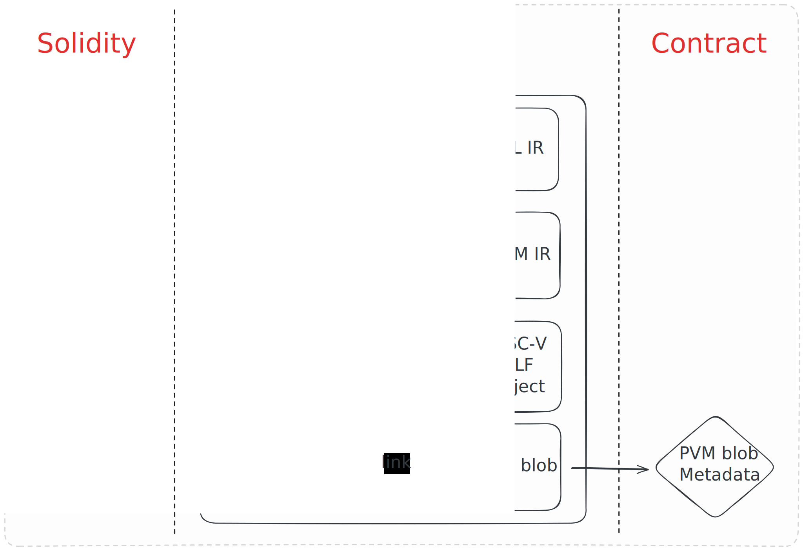

# Architecture

`revive` uses `solc`, the [Ethereum Solidity compiler](https://github.com/ethereum/solidity), as the Solidity frontend to process smart contracts written in Solidity. [LLVM](https://github.com/llvm/llvm-project), a popular and powerful compiler framework, is used as the compiler backend and does the heavy lifting in terms of optimizitations and RISC-V code generation.

`revive` mainly takes care of lowering the YUL intermediate representation (IR) produced by `solc` to LLVM IR. This approach provides a good balance between maintaining a high level of Ethereum compatibility, good contract performance and feasible engineering efforts.

## `revive` vs. `resolc` nomenclature

`revive` is the name of the overarching "Solidity to PolkaVM" compiler project, which contains multiple components (for example the YUL frontend but also the `resolc` executable itself).

`resolc` is the name of the single entry-point frontend binary executable, which transparently uses all revive components to produce compiled contract artifacts.

## Compilation process

When compiling a Solidity source file, the following steps happen under the hood:
1. `solc` is used to lower the Solidity source code into [YUL intermediate representation](https://docs.soliditylang.org/en/latest/yul.html).
2. `revive` lowers the YUL IR into LLVM IR.
3. LLVM optimizes the code and emits a RISC-V ELF shared object (through LLD).
4. The PolkaVM linker finally links the ELF shared object into a PolkaVM blob.

This compilation process can be visualized as follows:

