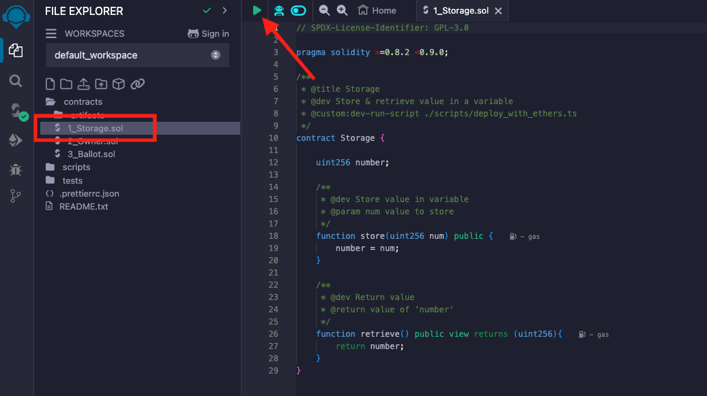
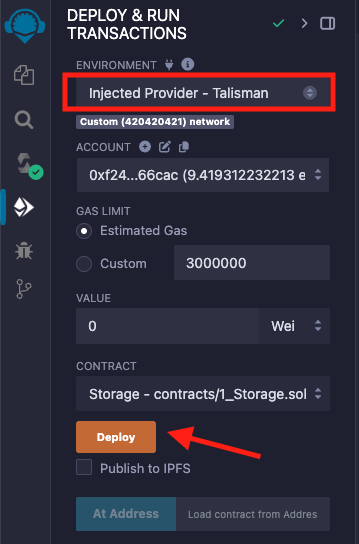
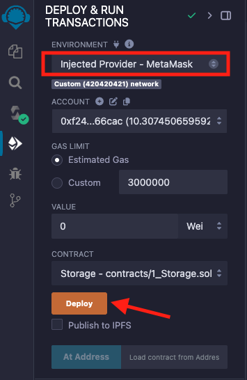
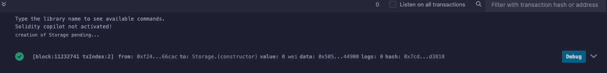
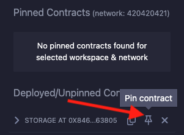
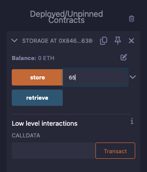
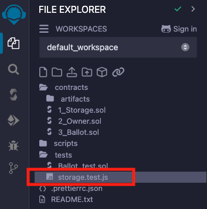
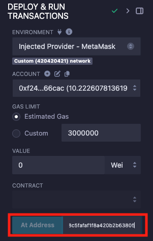

# Deploy Your First Contract

This guide will walk you through deploying and interacting with contracts in REMIX.

1. Load and Compile a Contract.

   Open the [REMIX IDE](https://remix.polkadot.io).
   By default, REMIX provides a sample workspace. Choose a Solidity contract to compile and click the **▶️** button.
   Alternatively, use the **Solidity Compiler** tab to compile the selected contract.

   

2. Deploy to Westend.

   1. Using Talisman wallet

      Select the **Injected Provider - Talisman** environment in the **Deploy & Run** tab. When prompted, allow Remix to connect to Talisman.
      Switch to the **Westend** network in Talisman. Make sure **Enable Testnets** is checked in Talisman to see the network.
      Your account address and balance will appear under the **ACCOUNT** section. Remix will automatically use the network selected in Talisman.

      

      Click **Deploy** and **Confirm** the transaction in Talisman.

   2. Using MetaMask wallet

      Select **Injected Provider - MetaMask** environment in the **Deploy & Run** tab.
      When prompted, allow REMIX to connect to MetaMask. Your account address and balance will be displayed under the **ACCOUNT** section.
      Ensure you are connected to the **Westend** network in MetaMask. If you are not already connected, switch to the correct network. Remix will automatically use the network selected in MetaMask.

      

      
Troubleshoot: "Injected Provider - MetaMask" is not listed

      If **Injected Provider - MetaMask** is not listed in the environments list and you are using the MetaMask extension, the extension may be configured to only read/write data on click.

      Try the following steps:
      1. Have the Remix IDE window open
      2. Click on the MetaMask extension icon
      3. Reload the Remix IDE window
      4. Redo the compilation and select your environment

      

      

      Click **Deploy** and **Confirm** the transaction in MetaMask.

   Wait for the deployment to complete, as indicated in the terminal panel.

   

## Interact with Your Deployed Contract

1. Interact with Deployed Contracts.

   Once deployed, your contract will appear in the **Deployed/Unpinned Contracts** section of the **Deploy & Run** tab.
   To keep your contract visible after reloading Remix, pin it to the workspace. Pinning a contract moves it to the **Pinned Contracts** section, ensuring it won't disappear upon reload. When pinned, Remix will save both the contract’s address and its ABI for easy access.

   

   You can interact with your contract by calling its methods from this section, with all transactions routed through your wallet.

   

2. Run Tests.

   Currently, REMIX supports JavaScript tests only.
   To run tests, navigate to the **File Explorer** and select any JavaScript test file in the **tests** directory.

   

   Run it by clicking the **▶️** button.

## How to Interact with Already Deployed Contracts

   If you need to interact with already deployed contracts, make sure to note down their addresses beforehand so you can load them later using the **At Address** button.

   
