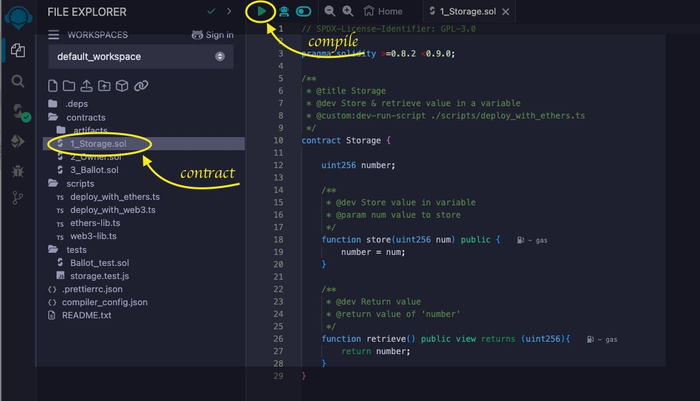
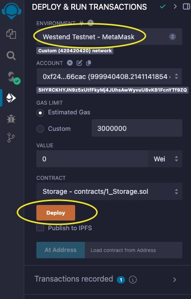
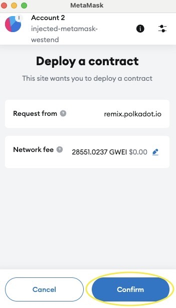
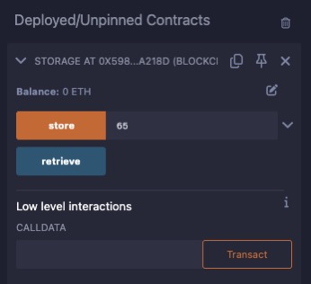
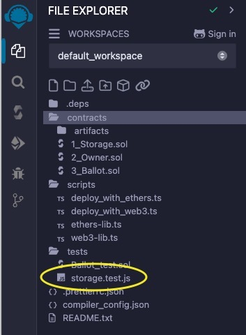
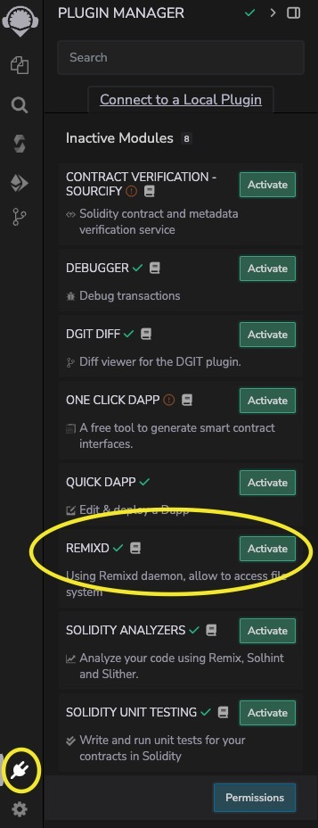

import {WestendNetworkButton} from '@site/src/components/NetworkButton';

# Deploy Your First Contract

This guide will walk you through deploying and interacting with contracts in REMIX.

1. Request some Test WND Tokens.

   You will need some test tokens to interact with the testnet.
   You can request Westend tokens from the [Westend Faucet](https://faucet.polkadot.io/westend?parachain=1000).
   Simply enter your MetaMask address and click **Send** to request Westend tokens.

1. Load and Compile a Contract.

   Open the [REMIX IDE](https://remix.polkadot.io).
   By default, REMIX provides a sample workspace. Choose a Solidity contract to compile and click the **▶️** button.
   Alternatively, use the **Solidity Compiler** tab to compile the selected contract.

   

1. Deploy to Westend.

   Select **Westend Testnet - MetaMask** environment in the **Deploy & Run** tab.
   When prompted, allow REMIX to connect to MetaMask. Your account address and balance will be displayed under the **ACCOUNT** section.

   

   Click **Deploy** and **Confirm** the transaction in MetaMask.

   

   Wait for the deployment to complete, as indicated in the terminal panel.

   

## Interact with Your Deployed Contract

1. Interact with Deployed Contracts.

   Once deployed, your contract will appear in the **Deployed/Unpinned Contracts** section of the **Deploy & Run** tab.

   

   You can interact with your contract by calling its methods from this section, with all transactions routed through MetaMask.

2. Run Tests.

   Currently, REMIX supports JavaScript tests only.
   To run tests, navigate to the **File Explorer** and select any JavaScript test file in the **tests** directory.

   

   Run it by clicking the **▶️** button.

## Connect to Your Local Filesystem

To enable seamless interaction between REMIX IDE and your local development environment, you can connect to your filesystem using the REMIXD tool. This allows you to easily manage and edit your smart contract files directly from REMIX IDE. Follow these steps to establish the connection.

1. Install Node

   As a prerequisite install Node, e.g., using [Volta](https://volta.sh/) (which will also install `npm`):

   ```bash
   # install Volta
   curl https://get.volta.sh | bash

   # install Node
   volta install node
   ```


2. Install REMIXD

   Install the REMIXD tool globally on your machine by running the following command in your terminal:

   ```bash
   npm install -g @remix-project/remixd
   ```

3. Run REMIXD

   After installation, launch the REMIXD server by specifying the directory you want to share and the REMIX IDE URL. Replace `<YOUR_DIRECTORY>` with the path to your local project folder:

   ```bash
   remixd -s <YOUR_DIRECTORY> -u https://remix.polkadot.io
   ```

4. Activate REMIXD plugin in REMIX

   Go to the **Plugin Manager** tab. Find **REMIXD**, click **Activate**, and then select **Connect** to link your local directory with the IDE.

   

## Generate and Deploy DApp UI with Quick DApp Plugin

The Quick DApp plugin in REMIX simplifies the process of creating and deploying decentralized applications (DApps). This tool automates the generation of a user interface (UI) for your smart contracts and facilitates quick deployment to the Surge platform.

1. Activate the Plugin

   Open REMIX IDE and navigate to the **Plugin Manager** tab. Search for **Quick DApp** and click **Activate**.

2. Select Your Contract

   Choose the smart contract you want to deploy from the **Deploy & Run** tab. The plugin will automatically identify your contract and generate a corresponding UI.

3. Configure the UI

   You can customize the UI components based on the functions of your smart contract. The plugin allows you to specify which functions to expose to the user interface.

4. Deploy to Surge

   Once your UI is configured, click the **Deploy** button. The plugin will handle the deployment process to Surge, providing you with a public URL to access your DApp.
