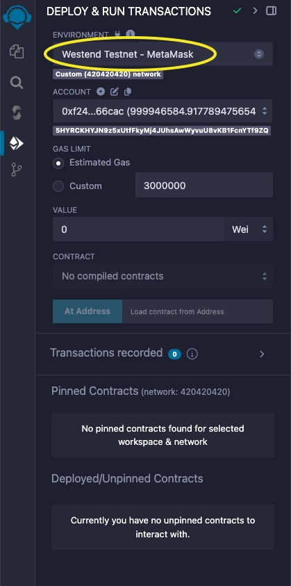
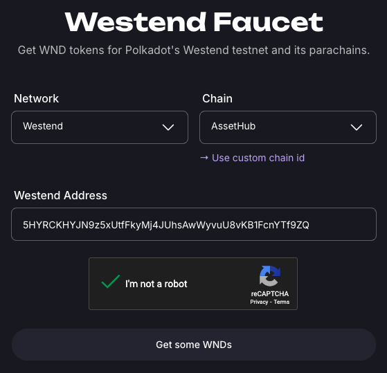
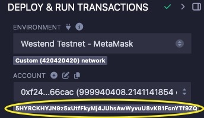
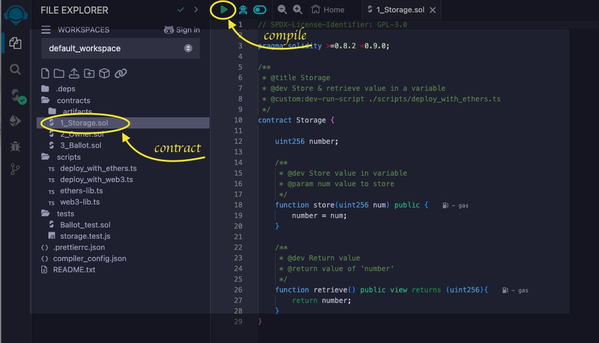
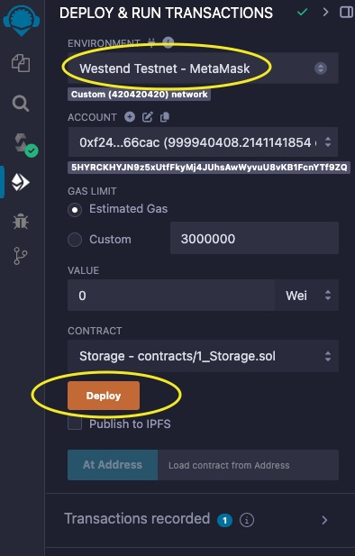
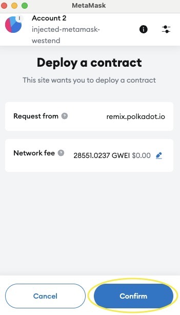
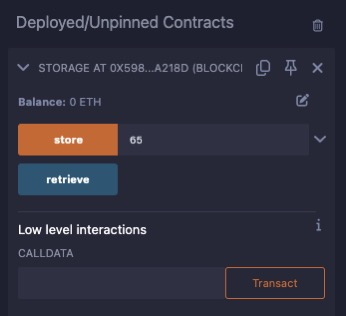
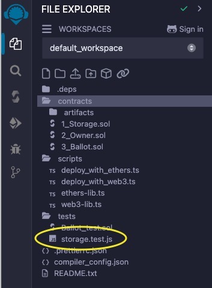

# Deploy your contract

This will teach you how to deploy your contract with REMIX.

1. Install MetaMask Wallet.
Install the [MetaMask](https://support.metamask.io/getting-started/getting-started-with-metamask/#how-to-install-metamask) browser extension and create an Ethereum account. MetaMask will allow REMIX to interface with the Westend network.
2. Launch REMIX.
Open [REMIX IDE](https://remix.polkadot.io) in your browser.
Navigate to the **Deploy & Run** tab.
Select **Westend Testnet - MetaMask** environment.

When prompted, allow REMIX to connect to MetaMask.
3. Request Westend (WND) Tokens.
Open the [Westend Faucet](https://faucet.polkadot.io/westend).
Enter your Westend address.

Note that this requires a Westend address, while in Metamask, an Ethereum address has been created. REMIX maps your Ethereum address to a Westend address, which can be viewed in the **Deploy & Run** tab under **Account**.

4. Compile the Contract.
By default, REMIX provides a sample workspace.
Choose your Solidity contract (*.sol file) and compile it by clicking the **▶️** button.

Alternatively, use the **Solidity Compiler** tab for compilation.
5. Deploy to Westend.
Confirm that the **Westend Testnet - MetaMask** environment is selected in the **Deploy & Run** tab.

Click **Deploy** and **Confirm** the transaction in MetaMask.

Wait for the deployment to complete, as indicated in the terminal panel.
6. Interact with Deployed contracts.
Once deployed, your contract will appear in the **Deployed/Unpinned Contracts** section of the **Deploy & Run** tab.

You can interact with your contract by calling its methods from this section, with all transactions routed through MetaMask.
7. Run Tests.
Currently, REMIX supports JavaScript tests only.
To run tests, navigate to the **File Explorer** and select any JavaScript test file in the **tests** directory.

Run it by clicking the **▶️** button.
