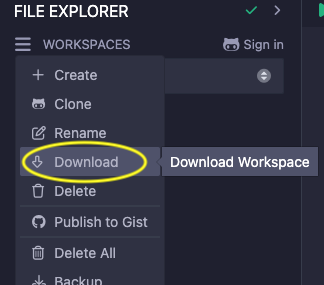

# REMIX Tips

## Generate and Deploy DApp UI with Quick DApp Plugin

The Quick DApp plugin in REMIX simplifies the process of creating and deploying decentralized applications (DApps). This tool automates the generation of a user interface (UI) for your smart contracts and facilitates quick deployment to the Surge platform.

1. Activate the Plugin

   Open REMIX IDE and navigate to the **Plugin Manager** tab. Search for **Quick DApp** and click **Activate**.

2. Select Your Contract

   Choose the smart contract you want to deploy from the **Deploy & Run** tab. The plugin will automatically identify your contract and generate a corresponding UI.

3. Configure the UI

   You can customize the UI components based on the functions of your smart contract. The plugin allows you to specify which functions to expose to the user interface.

4. Setup Surge

   ```bash
   # install surge
   npm install --global surge

   # create login
   surge login
   ```

5. Deploy to Surge

   Once your UI is configured, click the **Deploy** button. The plugin will handle the deployment process to Surge, providing you with a public URL to access your DApp.

## Connect to Your Local Filesystem

If you prefer working with contracts on your local filesystem, Remix can connect directly to it. Keep in mind that connecting to your local filesystem will switch your current workspace. If you want to keep working on contracts from your current workspace, make sure to download them first.



Note that switching to a local filesystem will cause all previously deployed contracts, both pinned and unpinned, to become invisible in the **Deploy & Run** tab. If you need to interact with already deployed contracts, make sure to note down their addresses beforehand so you can load them later using the **At Address** button.


To enable seamless integration between Remix IDE and your local development environment use the remixd tool. This allows you to easily manage and edit your smart contract files directly from Remix IDE. Follow these steps to establish the connection.

1. Install Node

   As a prerequisite install Node, e.g., using [Volta](https://volta.sh/) (which will also install `npm`):

   ```bash
   # install Volta
   curl https://get.volta.sh | bash

   # install Node
   volta install node
   ```

2. Install REMIXD

   Install the REMIXD tool globally on your machine by running the following command in your terminal:

   ```bash
   npm install -g @remix-project/remixd
   ```

3. Run REMIXD

   After installation, launch the REMIXD server by specifying the directory you want to share and the REMIX IDE URL. Replace `<YOUR_DIRECTORY>` with the path to your local project folder:

   ```bash
   remixd -s <YOUR_DIRECTORY> -u https://remix.polkadot.io
   ```

4. Activate REMIXD plugin in REMIX

   Go to the **Plugin Manager** tab. Find **REMIXD**, click **Activate**, and then select **Connect** to link your local directory with the IDE.

   
