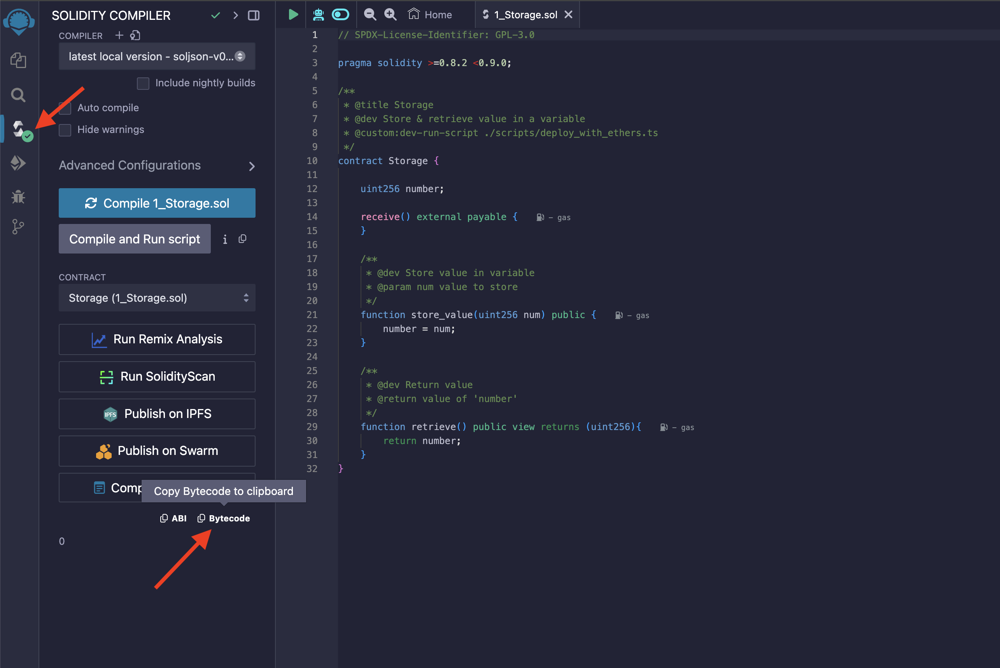
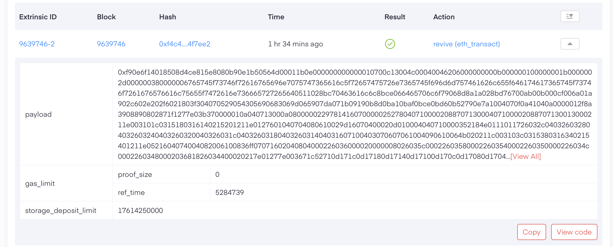
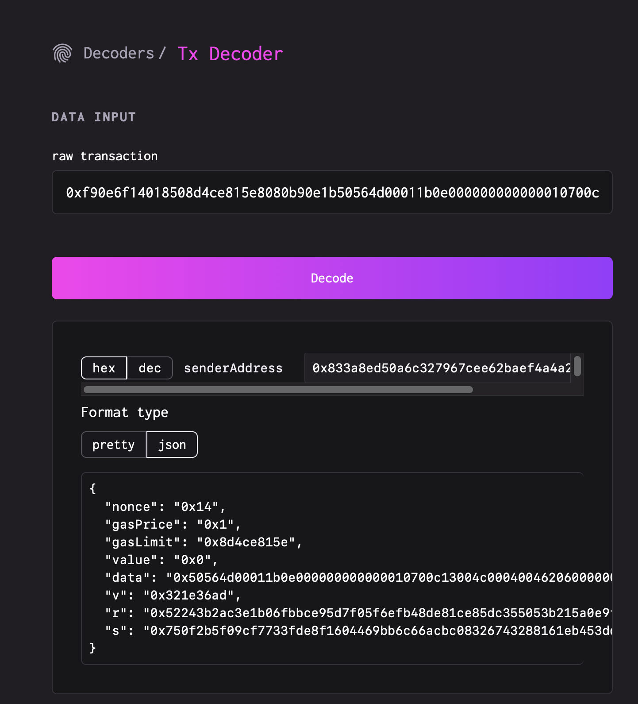
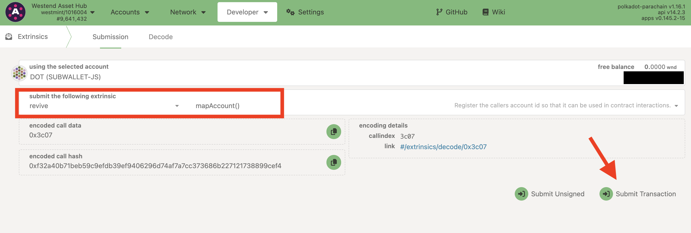
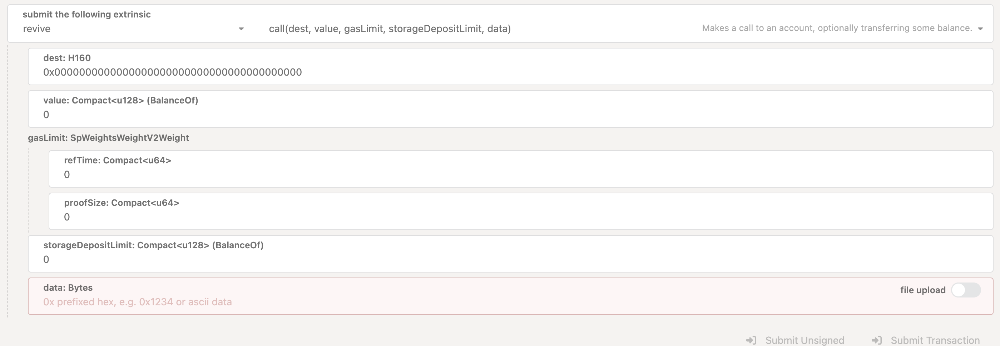
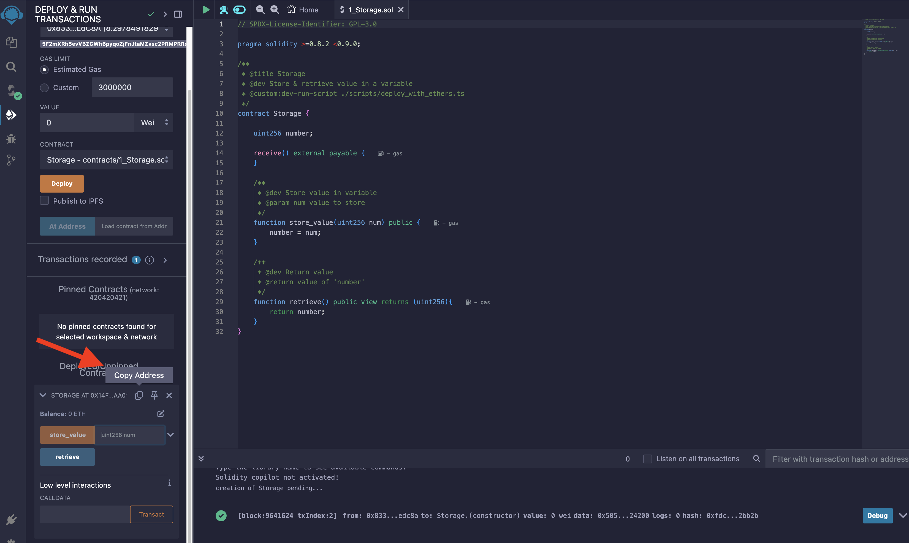
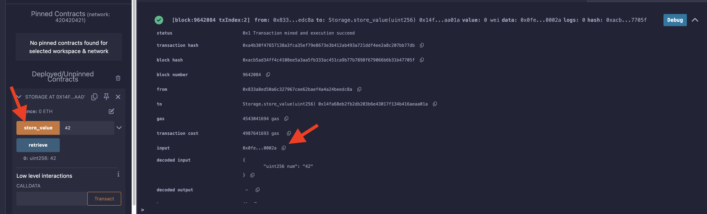
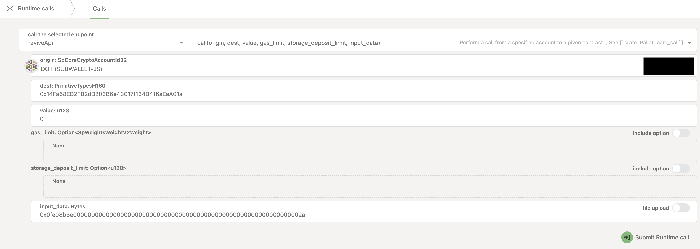

# Things to Try Out

If you’ve mastered the tutorial, here are a few things we think you could try. Afterwards, let us know how it went.

## Download Contract Code from REMIX

When using REMIX, you won’t even notice that under the hood we are using PolkaVM instead of EVM, apart from the currently
missing functionality.

If you’re interested in peeking into the PolkaVM code, you can download the compiled code from REMIX and disassemble it.

1. Install our PolkaVM [command-line tool](https://github.com/paritytech/polkavm/tree/master/tools/polkatool). We will use this later to inspect the code.
	```
	cargo install polkatool
	```
2. Compile any contract using REMIX as you learned in previous chapters of this tutorial.
3. Switch to the "Compiler" tab and copy the bytecode:
	
4. Paste the code as-is into a text file and save it as `code.txt`.
5. Convert the text into binary using `xxd`, which should be pre-installed in most environments:
	```
	$ xxd -r -p < code.txt > code.polkavm
	```
6. Now you have a valid PolkaVM module that you can examine with `polkatool`:
	```
	$ polkatool disassemble code.polkavm

	// RO data = 0/0 bytes
	// RW data = 0/66608 bytes
	// Stack size = 16384 bytes

	// Instructions = 933
	// Code size = 3031 bytes

	  : @0
	  0: a2 = a0
	  2: a3 = a0 >> 16
	  5: a0 = 0x0
	  7: jump @7 if a3 != 0
	  : @1
	10: a3 = 0x10000
	15: jump @7 if a3 <u a1
	  : @2
	18: a1 = a2 + a1
	21: a0 = a1 + 0x1f
	24: a0 = a0 & 0xffffffe0
	27: jump @4 if a0 <=u 65536
	  : @3
	33: a0 = 0x0
	...
	99: ecalli 4 // 'set_storage'
	...
	```

### RISC-V vs PolkaVM

Consult this [cheat sheet](https://projectf.io/posts/riscv-cheat-sheet/) to understand what’s going on here.
A few interesting things to `grep` for that are unique to PolkaVM:

*  The `ecalli` instruction is used to call into `pallet_revive`. The list of functions available to contracts can be found
[here](https://docs.rs/pallet-revive/latest/pallet_revive/trait.SyscallDoc.html). This is a custom instruction that doesn't exist in RISC-V. We replaced the
standard `ecall` instruction with it. The only difference is that `ecalli` takes an immediate value as part of the instruction, while `ecall` has no arguments.
We use this value to pass the syscall number. This allows us to statically see which functions a contract is calling. Otherwise, you wouldn’t be able to tell
from the disassembly that line 99 is calling `set_storage`.
* Look for the labels `[export #0: 'call']` and `[export #1: 'deploy']`. Those are the only entry points of a contract. The numbering doesn’t matter, though; they
are referenced by name. `call` is the entry point used when an existing contract is executed. `deploy` is the constructor and is called on deployment. Unlike
Ethereum, we keep the constructors on-chain, which is why we have two entry points instead of one.

## Decode Ethereum Transactions

It might be interesting to look at the transactions submitted to the testnet. When Ethereum transactions are submitted through
the Ethereum RPC proxy, they are submitted on-chain as a special `eth_transact` unsigned extrinsic. So far, we have only used the Ethereum
RPC, so all transactions submitted as part of this tutorial will be of this type. You can filter for all `pallet_revive` extrinsics
on Subscan, but make sure to set the filter to show "All" extrinsics. The default is to only show signed extrinsics, which would
filter out `eth_transact`. [Here](https://assethub-westend.subscan.io/extrinsic?page=1&time_dimension=date&signed=all&module=revive)
is a direct link with the correct filter already set.

Here’s how the contents of such an extrinsic look:


You will notice that it doesn't contain the sender of the transaction. This is because this extrinsic is unsigned and
doesn't contain a signature. However, the `payload` is the raw Ethereum transaction, which is indeed
signed. The sender of the extrinsic is determined by recovering the public key from that transaction. You can simply put the
`payload` into any tool that can decode Ethereum transactions to see the sender and other details.
[This website](https://tools.deth.net/tx-decoder) is one example:


### Decode the Contract Code

You’ll notice that the `to` field is missing in this example. This indicates that it will instantiate a new contract rather than calling
an existing one. This also explains why the `data` field is so large: it contains the contract code. The format is the same as on Ethereum:
`code ++ constructor_args`, where `++` denotes concatenation. The only difference is that `code` is a PolkaVM module and not EVM bytecode. You can use
`xxd` and `polkatool` as we learned [above](#download-contract-code-from-remix) to examine the code. Just keep in mind that you need to remove any trailing `constructor_args` if
they exist. Not all constructors take arguments; it depends on the contract.

You’ll know you need to do this if you get this error:
```
ERROR: failed to parse “data.polkavm”: failed to parse program blob: blob size doesn’t match the blob length metadata
```

But how do you know where the program blob ends and the constructor arguments start? The PolkaVM module header contains a field that tells
you the length of the module. It is a little-endian u64 at a fixed offset: `5` (just after the magic "PVM\0"). If `data` contains more than what
is specified in this field, it means that the extra bytes are the constructor arguments. You might try adding some functionality
to [`polkatool`](https://github.com/paritytech/polkavm/tree/master/tools/polkatool) to handle trailing data.

## Call a Contract via Polkadot.js Apps

So far, we have only used REMIX and Metamask to interact with contracts. However, you can also interact with `pallet_revive` using standard signed
extrinsics. We’re using the `1_Storage.sol` example contract here, which you can find in REMIX.

### Register Your Account

When registering, you will sign the transaction with a Polkadot native wallet and signature scheme, likely even a pre-existing
account. To use a Polkadot native wallet, you need to register (or "map") your account with `pallet_revive`. This is a one-time
action and is necessary to enable mapping between the AssetHub native and Ethereum addresses. Ethereum wallets don't require any registration.

1. Go to Polkadot.js Apps, connect to Westend AssetHub, and go to the `Developer -> Extrinsics` tab.
[Here](https://polkadot.js.org/apps/?rpc=wss%3A%2F%2Fwestend-asset-hub-rpc.polkadot.io#/extrinsics) is a direct link.

2. Select the `revive::map_account` extrinsic and submit it as a transaction. The account you used to sign this transaction is now registered and can be used to
interact with the other `pallet_revive` extrinsics.


### Call a Contract

You can now stay in the extrinsics tab and switch to the `call` extrinsic:


The fields are straightforward.

* `dest` is the contract you want to call. If you deployed via REMIX, you can find the address there. Please note that if no contract exists at `dest`, this will
fall back to a normal balance transfer, as this is the behavior on Ethereum:

* `value` is the amount of native currency you want to send with the call. Ensure the function you’re calling is marked `payable` in Solidity if you intend to input any amount other than `0` here.
* `data` is the input data passed into the contract. If it’s a Solidity contract, it will expect `func_selector ++ abi_encode(func_arguments)`. The `func_selector`
is four bytes and derived by hashing the function signature. The easiest way to encode your data is to call a function with REMIX and then just copy the `data` from the log:

* `gas_limit` and `storage_deposit_limit` need to be provided to constrain the resources the contract can consume. This is similar to `gas_limit` on Ethereum.
	More on the differences [here](/differences_to_eth#multi-dimensional-gas). You can input a large number to ensure it works or dry-run the call
	to learn about the resources it will consume. Read on to learn how to do this.

### Dry-Run a Contract Call

A dry run means asking your node to run a contract call locally, which tells you how many resources it consumed, among other information. Wallets do this
to suggest a `gas_limit` and estimate a fee. To perform a dry run manually, navigate to `Developer -> Runtime calls` in Polkadot.js Apps.
Then select `reviveApi::call`. You will see that the arguments are identical to those in the extrinsic above, except the resource limits are optional.
You can leave them unspecified, as you’re calling this function specifically to learn which values to specify.


I filled out the fields with values from REMIX. The input data specifies calling the function `store_value(42)`. The function selector is `0x0fe08b3e`, and the rest
of the input is the number `42` encoded as uint256, as specified in the Solidity code. Submitting this runtime call will return this result:
```json
{
  gasConsumed: {
    refTime: 248,804,212
    proofSize: 20,578
  }
  gasRequired: {
    refTime: 248,804,212
    proofSize: 21,058
  }
  storageDeposit: {
    Charge: 0
  }
  debugMessage:
  result: {
    Ok: {
      data:
    }
  }
  events: [...]
}
```

This tell us a few things. The fields in bold are the ones we need to look at to fill the limits in our extrinsic:
- `gasConsumed` is the amount of `refTime` and `proofSize` that the contract has consumed during execution. Please note that weights are not properly tuned right now, so
you can expect these numbers to change in the future.
- **`gasRequired`** is the amount that needs to be specified for the execution to be successful. This value can vary depending on the contract. The details are
not important here, but this is the value you want to use for your extrinsic. Usually, wallets add a bit of extra gas to ensure the transaction succeeds. This
accounts for the fact that the blockchain might be in a different state when submitting the extrinsic, which can lead to slightly different gas consumption compared
to the dry run.
- **`storage_deposit`** indicates how much storage deposit was charged to the transaction signer for this call. It can either be a `Charge` or a `Refund`. A refund
occurs if the call removed data from the state, while a charge occurs when state was added. In this case, state was neither removed nor added. This is because we created the state
when running the transaction in REMIX to learn about the `data`. Overwriting the value does not create additional state. You can try running this against a fresh
instance of the same contract, and you will get a non-zero `Charge`. Hence, we can pass `0` for `storageDepositLimit` in the extrinsic. In the case of a `Refund`, we can also
simply pass `0`.
- `debug_message`: Contracts can emit UTF-8 strings using the
[`debug_message`](https://paritytech.github.io/polkadot-sdk/master/pallet_revive/trait.SyscallDoc.html#tymethod.debug_message) host function. These messages would
appear here. This is strictly for debugging, and a production contract wouldn't print anything to save gas. There is currently no way to call this
function from Solidity.
- `result`: This tells us whether the call was successful and what data, if any, it returned. In this case, the call was successful, and no data was returned. This makes
sense for a function that mutates state. Usually, only view functions like `retrieve` return data.
- `events`: The logs emitted by the contract during execution. Removed from the listing above for brevity.

### What to Do Next

Some ideas:

* Use the information gained from the dry run to submit a `store_value` extrinsic. The dry run itself doesn't mutate any state, as every state change it does is discarded.
* Use the dry run to execute the `retrieve` message and check whether the value is properly set.
